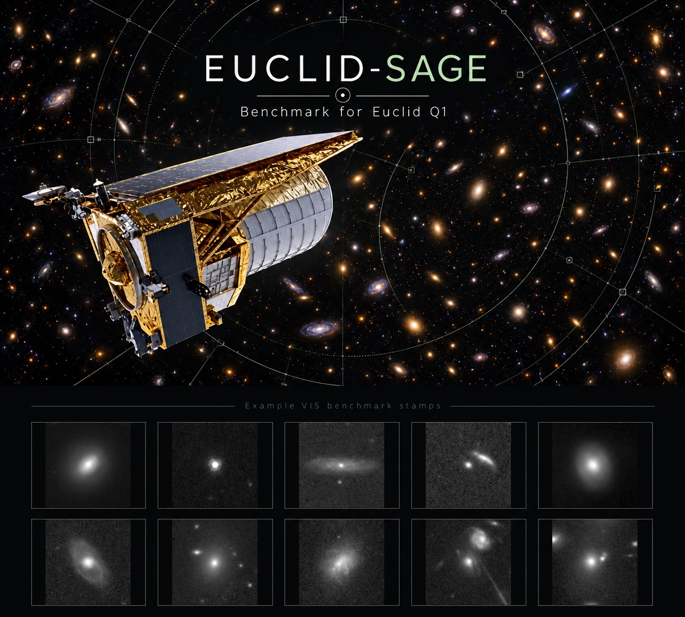

# EUCLID-SAGE: A benchmark suite for strong gravitational lens discovery



EUCLID-SAGE is a benchmark suite for discovery of strong gravitational lenses in real *Euclid* images. 
Each benchmark is a set of image stamps from the *Euclid* Quick Data Release 1 (Q1), labelled **lens (1)** 
or **non-lens (0)**. The lenses are the expert-graded lens candidates of the Euclid Q1 Strong Lensing 
Discovery Engine; the non-lenses are drawn from the official Euclid Q1 catalogues with three sampling rules.
The benchmark suite measures how well a model or human separates lenses from non-lenses, including when 
simple properties of the central galaxy such as brightness, galaxy type, size and roundness are controlled.

## The benchmarks

| Benchmark | Stamps | Lenses | Non-lenses | Non-lens selection |
|---|---:|---:|---:|---|
| `EUCLID-SAGE-1k-R_VIS` | 1,000 | 487 | 513 | **R**andom: any classified Q1 object |
| `EUCLID-SAGE-1k-S_VIS` | 1,000 | 487 | 513 | **S**imilar: galaxies of the same brightness as the lenses |
| `EUCLID-SAGE-1k-D_VIS` | 1,000 | 487 | 513 | **D**ifficult: galaxies matched in brightness, light concentration, size and roundness |

All three benchmarks share the same 487 lenses and differ only in their non-lenses. Larger versions 
with 9,513 non-lenses per type (`EUCLID-SAGE-10k-{R,S,D}_VIS`, about 5% lenses) are built with the same
code and are intended for an archived data release; the 1k non-lenses are the first entries of the
corresponding 10k lists.

- **R (random):** objects drawn at random from all Q1 objects with a Euclid classification (star,
  galaxy, quasar or a combination). Most are faint, so brightness alone separates them largely from
  the lenses; R measures performance against the general population of the survey.
- **S (similar):** galaxies with the same distribution of total VIS brightness as the lenses.
- **D (difficult):** galaxies matched to the lenses in VIS brightness, Sersic index, Sersic radius and
  ellipticity. None of these properties separates lenses from D non-lenses (single-property AUROC
  0.49-0.53), so a method must recognise lensing features in the image itself.

## Data format

**Stamps** (`benchmarks/stamps/<identifier>_VIS_101.fits`): one FITS file per object.

| Property | Value |
|---|---|
| Size | 101 x 101 pixels at 0.1 arcsec per pixel (about 10 arcsec) |
| Band | Euclid VIS (I_E) |
| Source | Euclid Q1 (`Q1_R1`) MER background-subtracted VIS mosaics, ESA Euclid Science Archive |
| Pixel values | as delivered, in ADU/s (`BUNIT`), 32-bit floating point; no rescaling |
| Zero point | `MAGZERO` = 24.6: AB magnitude = -2.5 log10(value) + 24.6 |
| Centring | the stamp centre is the pixel containing the catalogue position (within 0.05 arcsec) |
| Header | WCS, `BUNIT`, `MAGZERO`, `TILEIDX`, `MOSAIC`, `OBJTYPE` (lens / nonlens); lenses: `LENSID`, `GRADE`, `PHZLABEL`; non-lenses: `OBJECTID`, `PHZLABEL` |

Every stamp is complete: stamps with pixels outside the survey mosaics were never included.

**Benchmark tables** (`benchmarks/EUCLID-SAGE-<size>-<type>_VIS.csv`), one row per stamp:

| Column | Meaning |
|---|---|
| `stamp_file` | path of the stamp relative to `benchmarks/` |
| `label` | 1 = lens, 0 = non-lens |
| `object_id` | Euclid MER object identifier |
| `lens_id`, `grade` | lens catalogue identifier and expert grade (A or B); empty for non-lenses |
| `phz_label` | Euclid classification label (`phz_classification`: +1 star, +2 galaxy, +4 quasar) |
| `vis_magnitude` | total VIS AB magnitude from the official catalogue |
| `right_ascension`, `declination` | position (degrees) |
| `selection_rank` | order in which the non-lens was selected |
| `matched_lens_id` | lens to which an S or D non-lens was matched |

**Lens list** (`data/lenses.csv`): the 487 lenses with grade, expert score, position, Euclid label and
catalogue properties (VIS magnitude, Sersic index and radius, ellipticity, segmentation area).

**Checksums**: `benchmarks/SHA256SUMS.txt` (check with `shasum -a 256 -c benchmarks/SHA256SUMS.txt`).

## Quick start

```bash
pip install -r requirements.txt
python examples/quickstart.py
```

```python
from euclid_sage import load_benchmark, load_stamps, evaluate

table = load_benchmark("EUCLID-SAGE-1k-D_VIS")   # one row per stamp
stamps = load_stamps(table)                      # array (1000, 101, 101), raw values in ADU/s
labels = table.label.to_numpy()                  # 1 = lens, 0 = non-lens

scores = my_lens_finder(stamps)                  # any method: larger score = more likely a lens
print(evaluate(table, scores, threshold=0.5))
```

## Evaluation 

Report, for each benchmark (`python euclid_sage.py evaluate <benchmark> <predictions.csv>`):

- **AUROC** of the lens scores (threshold-free; computed from ranks);
- **completeness** (fraction of lenses found) and **false-alarm rate** (fraction of non-lenses
  flagged) at the method's decision threshold, with counts;
- **completeness for grade A and grade B lenses** separately;
- **precision** in the benchmark and the precision expected at realistic lens fractions
  (about 2 x 10^-4 among galaxies as bright as the lenses, 2 x 10^-5 among all classified objects),
  computed from completeness and false-alarm rate.

Methods that use the benchmark images for training must use cross-validation within a benchmark
and report it; the benchmarks share their lenses, so a model trained on one benchmark must not be
evaluated on another.

## Reproducing the benchmarks

The construction is scripted and reproducible (fixed random seed; archive query results are
sorted before any random draw). Inputs: the lens catalogue of the Euclid Q1 Strong Lensing Discovery
Engine (`q1_discovery_engine_lens_catalog.csv`, from its Zenodo record) and the public Euclid Q1
archive. Run the scripts from a data folder (or set `EUCLID_SAGE_DATA_DIR`):

| Step | Script | What it does | Time |
|---|---|---|---|
| 1 | `scripts/check_labels_and_properties.py` | Euclid label and catalogue values of the lenses
| 2 | `scripts/select_nonlenses.py` | the lenses and the ordered R and S non-lens lists
| 3 | `scripts/select_nonlenses_D.py` | the ordered D non-lens list
| 4 | `scripts/build_vis_benchmarks.py --types R S D` | downloads and cuts all stamps, writes the tables
| 5 | `scripts/verify_vis_benchmarks.py` | checks sizes, uniqueness, stamps, nesting and matching 
| 6 | `scripts/package_release.py --destination <folder>` | copies tables, stamps, reports and checksums
| - | `scripts/render_euclid_previews.py` | display pictures (arcsinh and MTF, as used by the Euclid lens search)

Every step, decision and intermediate result is documented in [`docs/DESIGN.md`](docs/DESIGN.md);
the dataset documentation follows the datasheet format in [`DATASHEET.md`](DATASHEET.md).

## Verification

All checks of `verify_vis_benchmarks.py` pass for the six benchmarks (1k and 10k; R, S and D): the
expected sizes with 487 lenses each, no duplicates, every stamp complete with the expected header,
the same lenses in all benchmarks, the 1k non-lenses contained in the 10k ones, no non-lens among the
lens candidates of the catalogue, and matched property distributions for S and D.

## Roadmap

- Archived release of the 10k R, S and D datasets.
- Colour versions of all benchmarks: the same objects with the Euclid NISP Y, J and H bands added to VIS.

## Citation

If you use EUCLID-SAGE, please cite the accompanying paper (in preparation):

> *EUCLID-SAGE: A Benchmark Suite and U-Net for Strong Gravitational Lens Discovery.*

and the sources of the data: the Euclid Q1 Strong Lensing Discovery Engine lens catalogue
(Euclid Collaboration: Walmsley et al. 2026, A&A 711, A26) and the Euclid Q1 data release
(Euclid Collaboration: Aussel et al. 2026). Publications using Euclid data should follow ESA's
Euclid data credits guide: https://www.cosmos.esa.int/web/euclid/data-credits-acknowledgements
